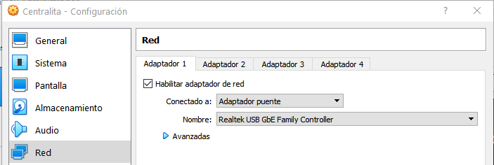

# Trabajo de Fin de Grado: Ciberataques y contramedidas en servicios críticos

## Cyberattacks and countermeasures in critical services

## Grado en Ingeniería Informática
---
### Autor: Damián Eduardo Domínguez De Barros
#### Tutora: Pino Caballero Gil
#### Cotutor: Carlos Rosa Remedios
---

## Máquinas virtuales en Oracle VM VirtualBox

Es necesario indicar en la configuración de las máquinas virtuales que el adaptador de red debe estar en modo puente.



## Ficheros cel.conf y cdr.conf

Antes de sustituir estos dos ficheros, comprobar si se muestra el error de las rutas con el comando

```shell
service asterisk status
```

## Fichero sip.conf

Se ha borrado la contraseña de los usuarios, por lo que es necesario añadir una nueva a cada uno.